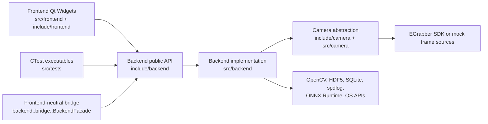

# Backend Boundaries

This document defines the dependency direction between backend and frontend code
and the rules for adding backend public APIs.

## Desired Dependency Direction

Rules:

- Frontend code may include `backend/*` headers.
- Backend code must not include `frontend/*` headers.
- Camera code must not include `frontend/*` headers.
- Backend tests may include backend and camera headers, but should not require
  Qt Widgets or UI resources unless they are explicitly frontend tests.
- Public backend headers should not expose frontend classes, widget types, tabs,
  dialogs, or UI controller types.

## Backend Responsibilities

Backend code owns capabilities that should work without a visible widget:

- service construction and lifecycle orchestration through `backend::AppBackend`
- capture, camera selection, mock camera configuration, and frame acquisition
- processing, realtime snapshots, experiment frame accumulation, and batch
  pipeline logic
- HDF5 persistence, SQLite state, frame recording, and playback storage
- autofocus, trigger, syringe pump, YOLO, logging, and crash reporting services
- shared data models such as `FrameStore`, `ProcessedFrame`, processing
  configuration, and camera frame types
- background threads, service callbacks, and worker lifecycle management

Backend code is Qt-free: `mib_backend` and `mib_processing` link no Qt and
include no Qt header (the `linux-backend-only` preset builds and tests them
from the `base,backend` apt sections, which carry no Qt packages; epic #246).
Widget layout, tab state, dialogs, and display-specific behavior belong in
the frontend; derived live analytics a view shows (e.g.
`MonitoringDensityService`, the Monitoring scatter KDE) run in the backend
so every shell reads the same result.

## Portable Processing Sub-Boundary (`mib_processing`)

Within backend, the deformability-cytometry algorithm and its I/O adapters
(`ProcessingService`, `EModulusLut`, `BatchMaskSources`, `Hdf5Service`,
`FrameStore`, `Tools`, `CrashStateMirror`) compile into a separate CMake
target, `mib_processing`, that must stay **Qt-free** — no `Qt6::*` link, no
`#include <Q...>` anywhere in its sources. `mib_backend` links
`mib_processing` publicly rather than compiling these files itself, so the
desktop app is unaffected; `backend-ci.yml` builds `mib_processing`
explicitly and fails if a Qt symbol leaks into it.

For `mib_processing` this is additionally a guarded contract: it
exists so `mib_processing` can be built and consumed (e.g. via Python
bindings) without a Qt toolchain at all — the artifact a non-Qt consumer
like Biowork's `services/mib-processing` links against. See
`docs/gold_standard_metrics.md` ("Portable Processing Contract") and the
[Biowork portability epic](https://github.com/KPT1020/mib-studio-qt/issues/220).

Where a `mib_processing` source needs functionality that would pull in Qt
(e.g. `Hdf5Service`'s optional performance telemetry, which the real
`CrashReporter` implementation depends on `QtGlobal`/`QString` for), inject it
as a callback set from the Qt-aware side at startup rather than linking Qt
into `mib_processing` — see `Hdf5Service::setHdf5PerformanceTraceHook` /
`src/frontend/core/main.cpp`.

## Frontend-Only Responsibilities

Frontend code owns user interaction and presentation:

- `QApplication`, `MainWindow`, tabs, dialogs, widgets, UI resources, and visual
  layout
- button/menu actions, tab-specific workflows, dialog validation, and display
  formatting
- Qt models used only for presenting backend data in tables or charts
- user-facing controller orchestration that sequences multiple backend service
  calls for a UI workflow
- local UI settings, startup preferences, and config watching that translate
  user choices into backend configuration
- image overlays, canvases, chart widgets, and view-specific rendering helpers

Frontend code should ask backend services to perform capture, processing,
persistence, hardware control, and long-running work instead of implementing
those behaviors in widgets.

## Public Backend API Rules

Public backend API means headers under `include/backend/` and
`include/camera/` that other modules include.

When adding or changing public backend APIs:

- Keep public types focused on backend concepts: services, configurations,
  value objects, snapshots, identifiers, callbacks, and error/status results.
- Prefer plain C++ data structures for cross-boundary values. Use Qt types only
  when there is an existing backend-level reason.
- Do not expose frontend classes or require callers to instantiate widgets,
  dialogs, tabs, UI controllers, or Qt models.
- Keep ownership clear. `AppBackend` owns long-lived services; callers should
  use references or explicit handles rather than creating duplicate service
  graphs.
- Keep threading explicit. Methods that start, stop, or interact with worker
  threads should document lifecycle expectations in the header or adjacent docs.
- Use callbacks for backend-to-frontend notifications instead of direct widget
  calls. For Qt signals, keep the bridge narrow, as with
  `BackgroundCaptureNotifier`.
- Make persistence and hardware side effects obvious from method names and
  return values.
- Keep service APIs testable from CTest without launching `mib_studio_qt`.

## Current Public API Entry Points

The main public backend entry point is `backend::AppBackend`:

- `initialize(dataDir)` constructs services and wires callbacks.
- service getters expose `sqlite()`, `hdf5()`, `capture()`, `processing()`,
  `playback()`, `cameraControl()`, `autofocus()`, `trigger()`, `yolo()`, and
  `syringePump()`.
- camera setup APIs configure mock or hardware selection and apply/reset
  hardware camera scripts.
- frame recording APIs start and stop direct HDF5 frame recording.
- `setBackgroundCaptureCallback()` exposes a narrow callback for background
  capture frames without Qt widget types.

For frontend adapters that should not call individual services directly, use
`backend::bridge::BackendFacade` from
`include/backend/app/BackendFacade.h`. It wraps an existing `AppBackend&`,
defines `BackendCommand` variants for camera, recording, processing settings,
recording load, and playback seek flows, and emits `BackendEvent` variants for
frame readiness, camera status, recording status, processing results, playback
position, and errors. See
[`frontend-neutral-backend-bridge.md`](frontend-neutral-backend-bridge.md).

Service headers under `include/backend/services/` are also public within the
application. They should remain callable by tests and frontend controllers
without requiring frontend objects.

## Allowed Direction Examples

Allowed:

- `src/frontend/tabs/PreviewPage.cpp` includes `backend/AppBackend.h` and calls
  capture or processing services.
- `src/tests/processing_batch_pipeline_test.cpp` includes
  `backend/services/ProcessingService.h` and links `mib_backend`.
- `src/backend/services/CaptureService.cpp` includes `camera/common/ICamera.h`.
- `src/backend/AppBackend.cpp` constructs services and wires service callbacks.

Not allowed for new code:

- `src/backend/services/*` including `frontend/tabs/*`.
- `include/backend/services/*` exposing a `QWidget`, tab, dialog, or frontend
  model in a method signature.
- Camera implementations calling UI dialogs directly for device selection.
- A frontend widget writing experiment HDF5 structures directly instead of
  using backend services.

## Adding A New Capability

Use this checklist when deciding where code should go:

- If it owns hardware, files, data processing, model inference, persistence, or
  background work, add it to backend.
- If it draws, formats, or validates a user interaction, add it to frontend.
- If it abstracts a camera device or mock frame source, add it to camera.
- If both backend and frontend need a value type, define it in the backend or
  camera public API only when it represents a backend domain concept.
- If only one widget uses a helper, keep the helper local to frontend.
- If tests should exercise it without launching the app, keep the behavior out
  of frontend widgets.
