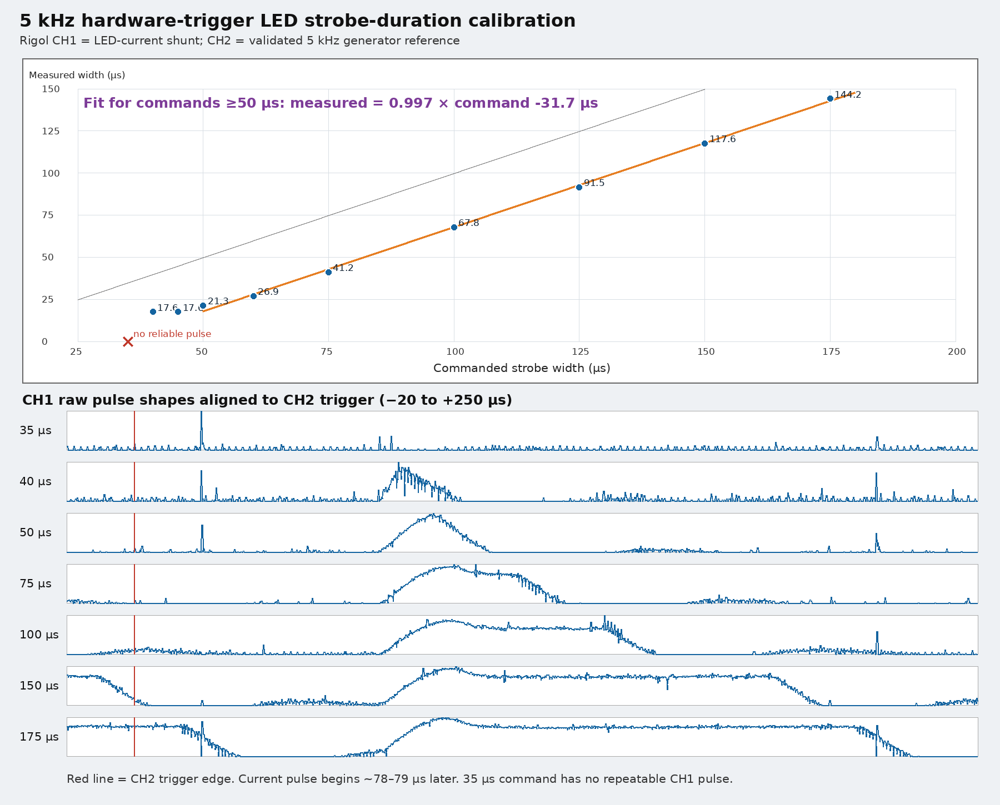
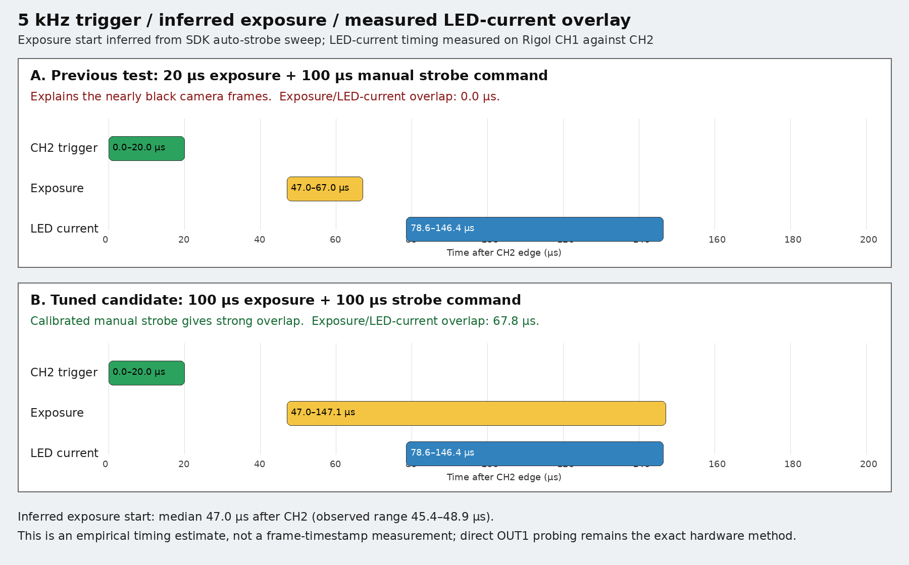
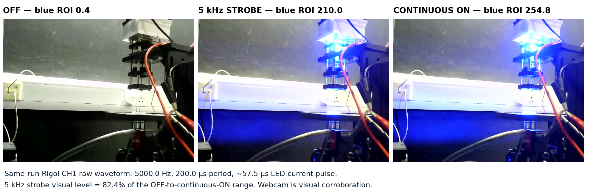

# MindVision XGC + R5D LED strobe bring-up

This runbook records the Linux bench setup validated on 2026-09-07 for a
MindVision XGC camera and an R5D pulsed constant-current LED driver. Treat the
oscilloscope result as the acceptance criterion; SDK readback, frame counts,
and webcam images are supporting evidence only.

## Hardware identity

- Camera family: **MindVision XGC**; tested unit: **MV-XG51GM**, 10GigE,
  monochrome IMX426.
- Illumination driver: **R5D** pulsed constant-current LED/laser driver,
  connected to the camera's physical **OUT1 / strobe output**.
  - Operator-provided listing: [激光驱动模块30A,40A可调恒流源 脉冲恒流源 LED驱动源0V-50V\[R5\]](https://e.tb.cn/h.8ok8fms7loohbEl?tk=mLr1T6VKaMa)
  - If the share link expires, search Taobao for that title and `R5D`.
- Trigger source: Zhongsheng (中盛科技) four-channel pulse generator over
  Modbus RTU, station 1, 9600 8N1. The tested Linux adapter identity was
  `usb-WCH.CN_USB_Quad_Serial_BC6296ABCD-if00`.
- Scope: CH2 on the generator-to-camera trigger; CH1 on the downstream,
  low-side LED-current shunt.

## Wiring

```text
Zhongsheng channel 1 ──────> MindVision TRIG_IN / input 0
MindVision physical OUT1 ──> R5D trigger/strobe input
R5D current output ─────────> blue LED

Rigol CH2 ──────────────────> generator-to-camera trigger
Rigol CH1 ──────────────────> downstream LED-current shunt
```

The MindVision SDK uses zero-based output indices: SDK output `0` is physical
**OUT1** on this camera. On the tested wiring, output high energizes the R5D
and output low turns it off.

> **Earth-referenced scope grounds:** Rigol probe grounds are common and earth
> referenced. Attach both grounds only to the established circuit common and
> measure LED current on the low-side shunt. Do not place a probe ground on a
> floating or isolated differential node: an earlier unsafe topology changed
> the LED state and invalidated the observation.

## Known-good 5 kHz settings

The following settings produced external-triggered frames and a measured LED
current pulse. They are a bench override, not a claim that the optical timing
is already optimized.

```json
{
  "width": 512,
  "height": 96,
  "exposure_time_us": 100.0,
  "auto_exposure_enabled": false,

  "trigger_mode": 2,
  "ext_trig_signal_type": 2,
  "ext_trig_jitter_us": 0,
  "acq_trigger_delay_us": 0,
  "trigger_count": 1,

  "strobe_mode": 1,
  "strobe_delay_us": 0,
  "strobe_pulse_width_us": 100,
  "strobe_polarity": 1
}
```

Generator channel 1 was set to **5000 Hz / 10% duty**, giving a measured CH2
high pulse of 19.8–20.0 µs every 200 µs.

Important differences from `resources/defaults/mindvisionConfig.json`:

- This camera required `ext_trig_signal_type: 2` (high-level trigger).
  Signal types 0 and 1 returned no frames on this bench; type 2 captured
  10/10 frames and sustained approximately 5 kfps.
- The shipped 35 µs strobe command is below the reliable R5D current-pulse
  threshold measured on this setup. Use a calibrated command of at least
  40–50 µs.
- The tested strobe delay was 0 µs. A real LED-current pulse still began
  approximately 78–79 µs after CH2's trigger edge.
- A 20 µs exposure did not overlap the measured LED current. A 100 µs
  exposure is the first validated starting point with substantial overlap.

## Rigol acceptance procedure

1. Force the generator to 0% duty before changing camera configuration.
2. Configure the camera, start streaming, select input 0 as trigger input and
   SDK output 0 as strobe output, then enter external-trigger mode.
3. Configure the Rigol and **read each setting back immediately**:
   - CH1: DC, 1× probe, 10 mV/div, 0 V offset.
   - CH2: DC, 1× probe, 500 mV/div, −1 V offset.
   - Timebase: 50 µs/div.
   - Trigger: CH2 rising edge, 1 V level, normal sweep.
   - Acquisition: 64× average.
4. Start the scope, enable generator channel 1 at 5000 Hz / 10%, and let the
   acquisition settle.
5. Stop the scope and query sample rate/timebase before downloading raw
   waveforms. Valid captures contain 8192 points at 5 MS/s.
6. Accept a CH1 duration only when the same acquisition has a valid CH2 result
   near 5000 Hz / 200 µs / 20 µs.
7. Restore generator duty and frequency to zero, leave camera output low, and
   verify LED off before disconnecting.

Do not rely on Rigol automatic CH1 frequency/width fields alone. They returned
`invalid` for real pulses with slow, triangular current edges. The raw CH1
waveform, aligned to valid CH2 edges and measured at its 50% level, is
canonical.

The Rigol can silently drop tightly batched SCPI setup commands. Set a field,
query it immediately, and reject the run if readback differs. Query the
acquisition state before waveform download; otherwise the instrument can
return a 600-point display trace instead of the 8192-point acquisition record.

## Measured 5 kHz strobe-duration calibration

| Commanded width (µs) | Measured CH1 current pulse (µs) | Result |
|---:|---:|---|
| 35 | — | No reliable periodic pulse |
| 40 | 17.6 | Detected |
| 45 | 17.6 | Detected |
| 50 | 21.3 | Detected |
| 60 | 26.9 | Detected |
| 75 | 41.2 | Detected |
| 100 | 67.8 | Detected |
| 125 | 91.5 | Detected |
| 150 | 117.6 | Detected |
| 175 | 144.2 | Detected |

For commands of at least 50 µs:

```text
measured_width_us = 0.9969 × commanded_width_us − 31.75
```

Useful starting commands are approximately 82 µs for 50 µs actual, 107 µs
for 75 µs actual, and 132 µs for 100 µs actual. At 5 kHz, prefer a command no
greater than **150 µs** during bring-up. Its current pulse ends near the next
200 µs period boundary; the 175 µs command extends across the next CH2 trigger
edge even though the LED still turns off before the following LED pulse.



Machine-readable data:
[`data/mindvision-xgc-r5d-strobe-calibration.csv`](data/mindvision-xgc-r5d-strobe-calibration.csv).

## Exposure-window overlay

A frame timestamp cannot resolve this interval: the MindVision frame timestamp
has approximately 0.1 ms granularity and does not mark exposure open/close.
The live camera capability mask also showed that physical OUT2 is GPIO-only;
physical OUT1 is the sole strobe-capable output and is already driving the
R5D.

The fallback measurement used SDK **automatic strobe mode**. The vendor API
defines that signal as active while the camera exposes. At 5 kHz, automatic
strobe was swept over 50, 75, 100, and 125 µs exposures. For each point, the
CH1 current falling edge minus the configured exposure duration inferred the
exposure start relative to CH2:

| Exposure (µs) | LED current window after CH2 (µs) | Inferred exposure start (µs) |
|---:|---:|---:|
| 50 | 79.0–98.9 | 48.9 |
| 75 | 79.6–123.2 | 48.2 |
| 100 | 79.2–145.9 | 45.4 |
| 125 | 79.8–170.9 | 45.9 |

The median inferred exposure start is **47.0 µs after CH2** (observed range
45.4–48.9 µs). This is an empirical estimate that assumes prompt R5D turn-off;
a direct probe of physical OUT1 in automatic-strobe mode remains the exact
hardware method.

The earlier 20 µs exposure therefore occupied approximately 47–67 µs, while
the 100 µs-command LED current occupied approximately 79–146 µs: **zero
overlap**, explaining the nearly black camera frames. With a 100 µs exposure,
the inferred 47–147 µs exposure window overlaps measured LED current for
about 67 µs.



Machine-readable data:
[`data/mindvision-xgc-r5d-exposure-overlay.csv`](data/mindvision-xgc-r5d-exposure-overlay.csv).

## Independent visual corroboration

A webcam comparison showed the blue LED dark with output low, strongly lit
under the 5 kHz strobe, and slightly brighter/more saturated with output held
continuously high. The fixed blue-region metric was 0.4 off, 210.0 strobing,
and 254.8 continuously on.



This confirms emitted light but does **not** measure duty cycle: webcam auto
exposure, gamma, and saturation are nonlinear. The Rigol current waveform
remains authoritative.

## What was proved

- High-level external triggering (`ext_trig_signal_type: 2`) captures at
  5 kHz with a 512×96 ROI; a sustained 5-second run returned 25,248 frames
  (about 5,049 frames/s at the host).
- Physical OUT1 controls the R5D: low is off, high is on, and manual strobe
  produces repeatable LED-current pulses.
- A 100 µs command produces roughly 65–68 µs of current at 5 kHz.
- The LED is visibly illuminated while those current pulses are present.
- Generator/camera trigger timing is stable at 5000 Hz.
- The original 20 µs exposure missed the LED-current pulse; a 100 µs exposure
  provides substantial measured overlap.

## Still to validate

- Direct OUT1 probing in automatic-strobe mode to replace the inferred
  exposure-start estimate with a hardware exposure-active trace.
- Image quality at 100 µs exposure and the final gain/current settings.
- Final operating current and thermal limits for the particular LED/R5D
  settings. The Taobao listing identifies the driver family but is not a
  substitute for a verified electrical datasheet and bench current limit.
- Long-duration dropped-frame behavior under final exposure, gain, ROI,
  processing, and recording load.

## Related documentation

- [`knowledge_map/camera/MindVisionCamera.md`](../../knowledge_map/camera/MindVisionCamera.md)
- [`knowledge_map/services/PulseGeneratorService.md`](../../knowledge_map/services/PulseGeneratorService.md)
- [`knowledge_map/task/2026-09-07-mindvision-xgc-r5d-strobe-validation.md`](../../knowledge_map/task/2026-09-07-mindvision-xgc-r5d-strobe-validation.md)
