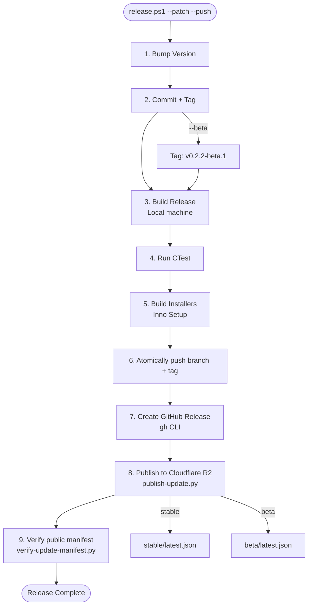

# Release Workflow

This guide documents the end-to-end process for releasing a new version of MIB Studio Qt, from version bumping through building installer packages and publishing updates.

## Overview

The release pipeline builds on a local Windows machine with the required proprietary dependencies, publishes installer assets to GitHub Releases with `gh`, and publishes the auto-update package to Cloudflare R2 through the Python command `publish-update.py`.
Calibration and lookup-table updates can be published independently with `publish-emodulus-lut.py`; see [`auto-update-r2.md`](auto-update-r2.md) for the LUT-specific object layout and rollback behavior.

All three desktop release entrypoints fail closed on release identity and
artifacts. `release.ps1` and both Actions workflows remove prior installer
outputs, require the exact numeric-version Setup and Update filenames, and
publish only those checked bytes. A beta release such as `v1.2.3-beta.4` still
uses `MIB_Studio_Qt_{Setup,Update}_v1.2.3.exe` locally and on GitHub, because
Inno Setup consumes CMake's numeric `PROJECT_VERSION`. Its immutable R2 object
is `MIB_Studio_Qt_Update_v1.2.3-beta.4.exe`, so successive betas cannot
overwrite one long-cached key.

### One-Command Release (`release.ps1`)

```powershell
# Production: bump, build, tag, push, create GitHub Release, publish to stable
.\release.ps1 --patch --push

# Beta: bump, build, tag as v0.2.2-beta.1, push, publish to beta channel
.\release.ps1 --patch --beta --push

# Preview what would happen
.\release.ps1 --patch --push --dry-run
```

Dry-run reports the prospective version and tag calculated from the selected
bump without editing the version file, committing, or tagging. Resolution
starts from the greater of `DEFAULT_VERSION` and every reachable stable/beta
tag's numeric version. A stale fallback at `1.0.3` with reachable
`v1.0.6-beta.3` therefore proposes patch `1.0.7`, not `1.0.4`.

### Release Channels

| Tag Format | Channel | GitHub Release | R2 Manifest | Auto-Update |
|---|---|---|---|---|
| `v1.2.3` | `stable` | Full release | `https://updates.yofo.bio/stable/latest.json` | All users |
| `v1.2.3-beta.1` | `beta` | Pre-release | `https://updates.yofo.bio/beta/latest.json` | Testers only |

### What `release.ps1 --push` Does

1. Bumps version in `cmake/MIBVersion.cmake`.
2. Commits the version bump.
3. Creates a git tag (`v0.2.2` or `v0.2.2-beta.1`).
4. Configures the exact numeric/full release identity, builds the full default
   Release target set, and runs CTest.
5. Clears old installer outputs, builds both Inno Setup installers, and fails
   unless the exact expected filenames exist.
6. Atomically pushes branch and tag to GitHub.
7. Creates a GitHub Release with installers and SHA-256 checksums; failure is
   fatal.
8. Publishes the update package to Cloudflare R2 via `publish-update.py`;
   failure is fatal.

All release publishers pass validated one-configure CMake overrides for both
the numeric version and full version. They read back
`build/mib-release-identity.txt` before compilation, preventing a beta binary
from inheriting the preceding tag's `PROJECT_VERSION_FULL`.
Run the local publisher from the repository root. It rejects another working
directory and requires a clean working tree; there is no interactive override
that could package uncommitted source absent from the tag. A pushed
stable release must run from `main`; beta releases may originate from a named
feature branch and atomically push that branch with the beta tag.

### Processing-core signer trust pin

Every shipped stable or beta desktop embeds the SHA-256 of the approved
processing-core Authenticode signer's DER `SubjectPublicKeyInfo`. Configure the
public repository Actions variable
`MIB_PROCESSING_CORE_SIGNER_SPKI_SHA256` with exactly 64 hexadecimal
characters. Both desktop release workflows fail before building when it is
missing; the manual `build-windows.yml` workflow checks it before writing the
prospective version into its workspace. It does not commit, tag, or push until
tests, both installer builds, exact-artifact validation, and Actions artifact
upload have succeeded; stable branch and tag refs are then pushed atomically.
Every non-`--skip-build` `release.ps1` run reads the
same variable from the destination repository before changing the version and
reconfigures CMake with the required production gate, including local/no-push
installer builds. `--skip-build` produces no binary and remains exempt.

The tag-triggered workflow validates that the requested input has the release
tag shape, checks out `refs/tags/<requested-tag>` explicitly, and verifies that
`HEAD` resolves to that tag before building. Manual dispatch therefore cannot
accidentally package the branch tip under a different release identity. CTest
also completes before the workflow uploads symbols or creates a Sentry release.

Derive the value from an executable or DLL signed with the actual PFX. This is
the same DER structure the application verifies; a certificate thumbprint,
whole-certificate hash, or raw public-key-bit hash is not interchangeable:

```powershell
$signature = Get-AuthenticodeSignature .\signed-fixture.dll
if ($signature.Status -ne 'Valid') { throw "Signature is not valid" }
$certificate = $signature.SignerCertificate
$key = [System.Security.Cryptography.X509Certificates.RSACertificateExtensions]::GetRSAPublicKey($certificate)
if (-not $key) {
    $key = [System.Security.Cryptography.X509Certificates.ECDsaCertificateExtensions]::GetECDsaPublicKey($certificate)
}
if (-not $key) { throw "Unsupported signing key" }
try { $spki = $key.ExportSubjectPublicKeyInfo() } finally { $key.Dispose() }
$sha256 = [System.Security.Cryptography.SHA256]::Create()
try { $pin = -join ($sha256.ComputeHash($spki) | ForEach-Object { $_.ToString('x2') }) } finally { $sha256.Dispose() }
gh variable set MIB_PROCESSING_CORE_SIGNER_SPKI_SHA256 --repo KPT1020/mib-studio-qt --body $pin
```

The `mib-processing-v*` workflow independently derives the SPKI from the DLL
after signing and refuses to upload it unless it matches this repository
variable. A certificate renewal that keeps the public key keeps the same pin;
a new key requires a coordinated desktop/core rollout because the current
desktop accepts one SPKI.

The native signing step is isolated in the GitHub `Production` environment.
The Windows build job uploads only an unsigned, already-tested artifact; the
tag-only signing job consumes `WINDOWS_SIGNING_CERTIFICATE_BASE64` and
`WINDOWS_SIGNING_CERTIFICATE_PASSWORD`, timestamps the DLL, verifies
Authenticode and the DER-SPKI pin, and only then exposes the canonical signed
artifact to the release job. PR CI uses the already trusted, Microsoft-signed
Windows SDK `signtool.exe` as an independent signed sample, derives its signer
SPKI, and tests unsigned/valid/wrong-signer/tamper outcomes without production
secrets, certificate generation, or hosted-runner trust-store mutation.

The production identity is the KPT organizational root/leaf chain
(`deploy/signing/README.md`). Because that root is not publicly trusted, the
tag-only Production signing job first imports the committed public root
certificate into the ephemeral runner's `LocalMachine\Root` store through the
.NET `X509Store` API (never `certutil`, which hangs on hosted images) so
`Get-AuthenticodeSignature` can chain-validate; the DER-SPKI pin comparison
remains the actual trust decision, and PR CI is unaffected. Workstations
running MIB Studio install the same public root once (see
`deploy/signing/README.md`); machines without it fail closed.

### Linux processing-core Ed25519 signing

The `mib-processing-v*` tag workflow signs the Linux `.so` in a separate
tag-only `sign-native-plugin-linux` job, also isolated in the `Production`
environment. The Linux build job uploads an unsigned, already-audited
artifact whose sidecar carries only a rehearsal envelope from an ephemeral
key; the Production job consumes the `LINUX_ED25519_SIGNING_KEY_PEM` secret,
refuses to sign unless the key's DER-SPKI SHA-256 equals the repository
variable `MIB_PROCESSING_CORE_ED25519_SPKI_SHA256`, produces the detached
RFC 8032 signature over the exact artifact bytes, verifies it, and replaces
every transported `signing` field in the sidecar with the production
envelope. The release job requires the signed `.so`/`.json` pair in the flat
asset set; envelope format, rotation, and revocation policy live in
`docs/architecture/processing-core-linux-signing.md`.

Native sidecars also require explicit repository variables
`MIB_PROCESSING_CORE_APP_MIN_VERSION` and
`MIB_PROCESSING_CORE_APP_MAX_VERSION`. Release CMake rejects absent,
non-numeric, or reversed bounds. The current supported loader range is
`1.0.6` through `1.0.99`; update it deliberately when desktop compatibility
is requalified.

### Crash reporting (Sentry) in the tagged release

The tag-triggered CI release (`.github/workflows/release.yml`) also wires up
Sentry so crashes from shipped builds are actually useful:

- **DSN injection** — the Configure step passes `-DMIB_SENTRY_DSN` from the
  `SENTRY_DSN` secret, so the installed app sends events (without it, releases
  run in local-only mode and nothing reaches Sentry).
- **Debug symbol upload** — after the build it runs
  `sentry-cli debug-files upload` on `build\Release` and creates/finalizes the
  `mib_studio_qt@<version>` release. Without uploaded PDBs, captured minidumps
  are unsymbolicated (= useless stacks). Gated on `SENTRY_AUTH_TOKEN` /
  `SENTRY_ORG` / `SENTRY_PROJECT` (skips cleanly if absent).

Required release secrets for symbolicated Sentry crashes: `SENTRY_DSN`,
`SENTRY_AUTH_TOKEN`, `SENTRY_ORG`, `SENTRY_PROJECT` (and `SENTRY_URL` for
self-hosted). `crashpad_handler.exe` must ship next to the app (the installer
copies it); verify it is present in the build output.

Options:

- `--patch|--minor|--major`: version bump type (required)
- `--beta`: create a beta/pre-release (`v0.2.2-beta.1`, channel `beta`)
- `--push`: push tag, create GitHub Release, and publish to R2
- `--skip-build`: skip build and publish; tag and push only
- `--dry-run`: show what would happen without making changes
- `--profile`: AWS/R2 profile for publishing; defaults to `MIB_STUDIO_R2_PROFILE`

## Prerequisites

Before starting a release, ensure you have:

1. Complete development environment:
   - CMake 3.21+, MSVC, Conan 2.x, Qt6
   - eGrabber SDK and Coremor DLLs
2. Inno Setup 6:
   - Default path: `C:\Program Files (x86)\Inno Setup 6\`
3. GitHub CLI:
   - Install from `https://cli.github.com/`
   - Authenticate with `gh auth login`
4. Cloudflare R2 publishing configuration:
   - Public custom domain: `https://updates.yofo.bio`
   - Dedicated bucket: `mib-studio-qt-updates`
   - Preferred for agent/Linux publishing: authenticated Wrangler session with R2 access.
   - S3 alternative: `MIB_STUDIO_R2_ENDPOINT="https://<account-id>.r2.cloudflarestorage.com"` plus `MIB_STUDIO_R2_PROFILE="mib-studio-r2"` or AWS credential environment variables.
   - GitHub Actions secrets:
     - `R2_ACCESS_KEY_ID`
     - `R2_SECRET_ACCESS_KEY`
     - `MIB_STUDIO_R2_ENDPOINT`
     - `WINDOWS_SIGNING_CERTIFICATE_BASE64`
     - `WINDOWS_SIGNING_CERTIFICATE_PASSWORD`
   - GitHub Actions repository variables (public compatibility/trust data):
     - `MIB_PROCESSING_CORE_SIGNER_SPKI_SHA256`
     - `MIB_PROCESSING_CORE_APP_MIN_VERSION`
     - `MIB_PROCESSING_CORE_APP_MAX_VERSION`
   - GitHub Actions publish step maps to AWS env vars:
     - `AWS_ACCESS_KEY_ID=${{ secrets.R2_ACCESS_KEY_ID }}`
     - `AWS_SECRET_ACCESS_KEY=${{ secrets.R2_SECRET_ACCESS_KEY }}`
     - `MIB_STUDIO_R2_ENDPOINT=${{ secrets.MIB_STUDIO_R2_ENDPOINT }}`
     - and invokes `publish-update.py --upload-method s3`
   - Optional proprietary dependency secrets:
     - `CONAN_REMOTE_URL`
     - `CONAN_REMOTE_USER`
     - `CONAN_REMOTE_PASSWORD`
   - Optional symbol upload secrets:
     - `SENTRY_DSN`
     - `SENTRY_AUTH_TOKEN`
     - `SENTRY_URL`
     - `SENTRY_ORG`
     - `SENTRY_PROJECT`
   - Do not commit R2 credentials or write tokens to the repo.
5. Python. Install `boto3` only when using the S3-compatible upload backend instead of Wrangler.

For R2 bucket, DNS, cache, migration, and rollback details, see [`auto-update-r2.md`](auto-update-r2.md).

## Complete Workflow

### Step 1: Bump Version

For a release, first resolve the effective line (including reachable beta
tags). `release.ps1` consumes this JSON automatically:

```powershell
python scripts/resolve_desktop_release_version.py --bump patch
```

`bump-version.ps1` only increments the fallback literal; use it for manual
maintenance only when the resolver reports `default_version ==
current_version`.

```powershell
.\bump-version.ps1 --patch
.\bump-version.ps1 --minor
.\bump-version.ps1 --major
.\bump-version.ps1 --patch --tag
```

The script reads `DEFAULT_VERSION`, calculates the new semantic version, updates the CMake version file, and optionally creates an annotated git tag.

### Step 2: Build Release Configuration

```powershell
cmake -S . -B build `
  -DMIB_ENABLE_MINDVISION=ON `
  -DMIB_MINDVISION_SDK_ROOT=<provisioned-sdk-root> `
  -DMIB_MINDVISION_RUNTIME_DIR=<provisioned-runtime-dir> `
  -DMIB_REQUIRE_PROCESSING_CORE_SIGNER_SPKI=ON `
  -DMIB_PROCESSING_CORE_SIGNER_SPKI_SHA256=<approved-64-hex-pin> `
  -DMIB_RELEASE_VERSION_OVERRIDE=<numeric-version> `
  -DMIB_RELEASE_VERSION_FULL_OVERRIDE=<full-version>
cmake --build build --config Release
ctest --test-dir build --build-config Release --output-on-failure --timeout 30
```

The supported release entry points run
`scripts/provision-mindvision-sdk.ps1` before this configure step. It pins the
team R2 SDK by SHA-256, validates the APIs used by the backend, and makes the
extracted include/runtime paths available to CMake. Releases also require
`build/Release/MVCAMSDK_X64.dll`; missing SDK support is a hard failure, not a
stub fallback.

The generic `windows-default` preset intentionally leaves the requirement off
for local development and fork CI. Such an unpinned Release executable fails
closed when asked to load a native core and is not eligible for distribution.

Processing-core release tags derive their registry channel from the wheel
version: plain `X.Y.Z` publishes stable, while a PEP 440 prerelease such as
`X.Y.Zrc1` publishes beta and creates a GitHub prerelease. Channel publication
is serialized independently. Rollback/promotion uses **Actions → Promote or
roll back processing core**; it accepts only an existing immutable version and
verifies the public pointer and every referenced artifact after the change.

Verify the build:

```powershell
Test-Path build\Release\mib_studio_qt.exe
Test-Path build\Release\platforms\qwindows.dll
Test-Path build\Release\imageformats\qjpeg.dll
```

### Step 3: Build Installer Packages

```powershell
cmake --build build --config Release --target package_installer
cmake --build build --config Release --target package_installer_update
```

Installer outputs:

```text
build\dist\MIB_Studio_Qt_Setup_v<version>.exe
build\dist\MIB_Studio_Qt_Update_v<version>.exe
```

Use the update package for auto-updates. The full setup installer is for first-time manual installs.

### Step 4: Publish Packages

Set R2 publishing configuration. By default, `publish-update.py` uses Wrangler when `MIB_STUDIO_R2_ENDPOINT` is not set. Set `MIB_STUDIO_R2_ENDPOINT` and `MIB_STUDIO_R2_PROFILE` only when publishing through S3-compatible credentials.

Publish the update package:

```bash
python publish-update.py \
  --installer "build/dist/MIB_Studio_Qt_Update_v0.2.0.exe" \
  --version "0.2.0" \
  --release-notes-url "https://github.com/gavinlouuu-kpt/mib-studio-qt/releases/tag/v0.2.0"
```

Publish the optional full installer:

```bash
python publish-update.py --installer "build/dist/MIB_Studio_Qt_Setup_v0.2.0.exe"
```

`publish-update.py`:

- Validates the installer exists and has nonzero size.
- Auto-detects the version from `MIB_Studio_Qt_(Setup|Update)_vX.Y.Z.exe`.
- Requires `--version X.Y.Z-beta.<identifier>` for a beta so manifest identity
  and its immutable R2 filename retain the complete prerelease suffix.
- Computes SHA-256 and file size.
- Generates `<channel>/latest.json`.
- Uploads the installer and manifest to `s3://mib-studio-qt-updates/<channel>/...`.
- Updates `<channel>/index.json` (the version catalog the in-app **Software
  Updates** dialog reads — inserts the new version, dedupe by version,
  newest-first; equal numeric SHA betas use publication time, with a
  deterministic version tie-break; an empty index self-seeds with the prior
  `latest.json`).
- Prints final public URLs under `https://updates.yofo.bio`.

Important parameters:

- `--endpoint`: R2 S3 API endpoint; defaults to `MIB_STUDIO_R2_ENDPOINT`
- `--bucket`: R2 bucket; defaults to `mib-studio-qt-updates`
- `--public-base-url`: public custom domain; defaults to `https://updates.yofo.bio`
- `--channel`: `stable` by default, `beta` for beta releases
- `--profile`: AWS/R2 profile; defaults to `MIB_STUDIO_R2_PROFILE`
- `--acl`: optional ACL for legacy S3-compatible targets; leave empty for R2
- `--release-notes-url`: optional GitHub release or changelog URL
- `--upload-method`: `auto` by default; uses S3 when `--endpoint`/`MIB_STUDIO_R2_ENDPOINT` is set, otherwise Wrangler

## Verification Steps

After publishing, verify public access from a network path that does not use private credentials:

```bash
python verify-update-manifest.py
```

For beta channel:

```bash
python verify-update-manifest.py --manifest-url "https://updates.yofo.bio/beta/latest.json"
```

Manual checks:

```powershell
Invoke-WebRequest -Uri "https://updates.yofo.bio/stable/latest.json" -Method Head
$manifest = Invoke-WebRequest -Uri "https://updates.yofo.bio/stable/latest.json" | ConvertFrom-Json
Invoke-WebRequest -Uri $manifest.installer_url -Method Head
```

App smoke checks:

- New builds should use `https://updates.yofo.bio/stable/latest.json` by default.
- Override still works for emergency reroutes:

```powershell
$env:MIB_STUDIO_UPDATE_MANIFEST_URL = "https://updates.yofo.bio/stable/latest.json"
```

Launch the app and use Help -> Check for Updates.

## One-Command Reference

```powershell
# Production release
$env:MIB_STUDIO_R2_ENDPOINT = "https://<account-id>.r2.cloudflarestorage.com"
$env:MIB_STUDIO_R2_PROFILE = "mib-studio-r2"
.\release.ps1 --patch --push

# Beta release
.\release.ps1 --patch --beta --push
```

## Step-by-Step Reference

Prefer `release.ps1`; it performs the effective-version calculation, identity
override, test gate, and atomic ref push as one fail-closed operation. The
commands below assume `v0.2.2` was already selected with
`scripts/resolve_desktop_release_version.py`, written to `DEFAULT_VERSION`,
committed, and tagged.

```powershell
cmake -S . -B build `
  -DMIB_RELEASE_VERSION_OVERRIDE=0.2.2 `
  -DMIB_RELEASE_VERSION_FULL_OVERRIDE=0.2.2 `
  -DMIB_REQUIRE_PROCESSING_CORE_SIGNER_SPKI=ON `
  -DMIB_PROCESSING_CORE_SIGNER_SPKI_SHA256=<approved-64-hex-pin>
cmake --build build --config Release
ctest --test-dir build --build-config Release --output-on-failure
cmake --build build --config Release --target package_installer
cmake --build build --config Release --target package_installer_update
git push --atomic origin HEAD:main refs/tags/v0.2.2
gh release create v0.2.2 build\dist\MIB_Studio_Qt_Setup_v0.2.2.exe build\dist\MIB_Studio_Qt_Update_v0.2.2.exe
python publish-update.py --installer "build/dist/MIB_Studio_Qt_Update_v0.2.2.exe" --version 0.2.2
python verify-update-manifest.py
```

## Workflow Diagram



## Legacy Client Compatibility

`s3.yofo.bio` is **retired**. All releases publish only to `https://updates.yofo.bio`
(the compiled default since PR #169) — no release should target the old host.

Builds compiled before PR #169 still request
`https://s3.yofo.bio/mib-studio-qt-updates/stable/latest.json` and will **not**
auto-update. Upgrade those installs manually (download and run the current full
installer once); from that point on they track `updates.yofo.bio` like every
other client. Do not reintroduce an `s3.yofo.bio` manifest or redirect.

## Rollback

If a bad R2 release is published:

1. Publish a corrected `stable/latest.json` that points at the last known-good update package.
2. Run `python verify-update-manifest.py`.
3. Purge Cloudflare cache for mutable manifest paths if stale content is observed.
4. Confirm clients pick up the corrected `updates.yofo.bio` manifest (no legacy `s3.yofo.bio` endpoint is involved).

## Troubleshooting

**R2 upload fails**

- Confirm `MIB_STUDIO_R2_ENDPOINT` is set to the account-specific R2 S3 API endpoint.
- Confirm `MIB_STUDIO_R2_PROFILE` or AWS environment variables provide write access to the dedicated bucket.
- Confirm Python can import `boto3`.

**Manifest returns 403, 404, or stale content**

- Confirm `updates.yofo.bio` is attached to the intended R2 bucket.
- Confirm public read access is enabled through Cloudflare.
- Confirm mutable manifests have short TTL or cache bypass rules.

**Auto-update check fails**

- Run `python verify-update-manifest.py`.
- Confirm `installer_url` in the manifest points to
  `https://updates.yofo.bio/<channel>/MIB_Studio_Qt_Update_v<full-version>.exe`
  (including the `-beta.*` suffix for beta releases).
- Check app logs for HTTP status code and response body.
