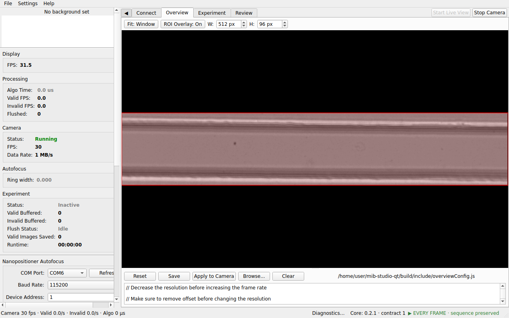
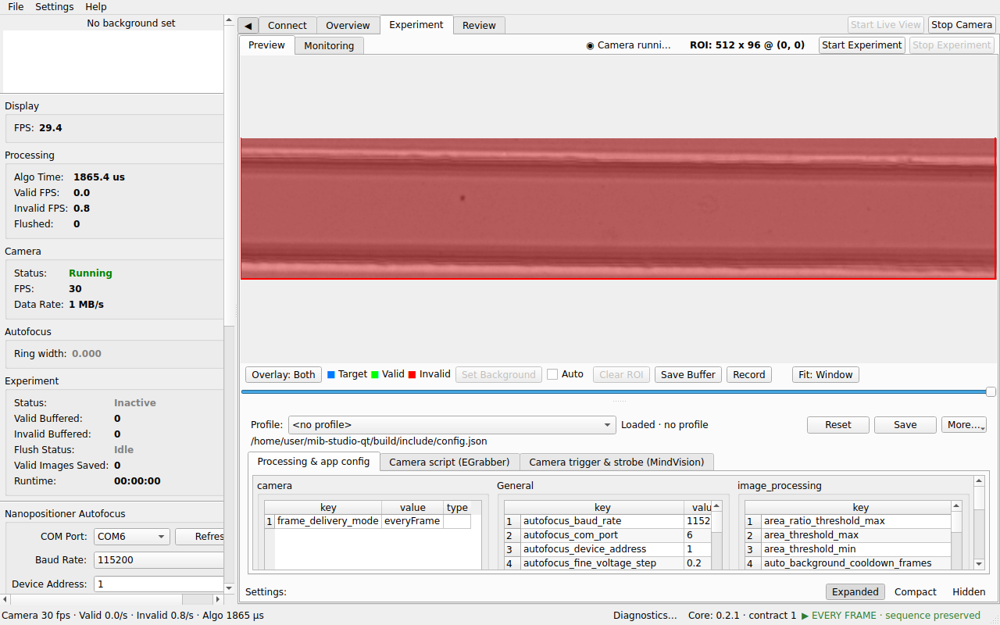
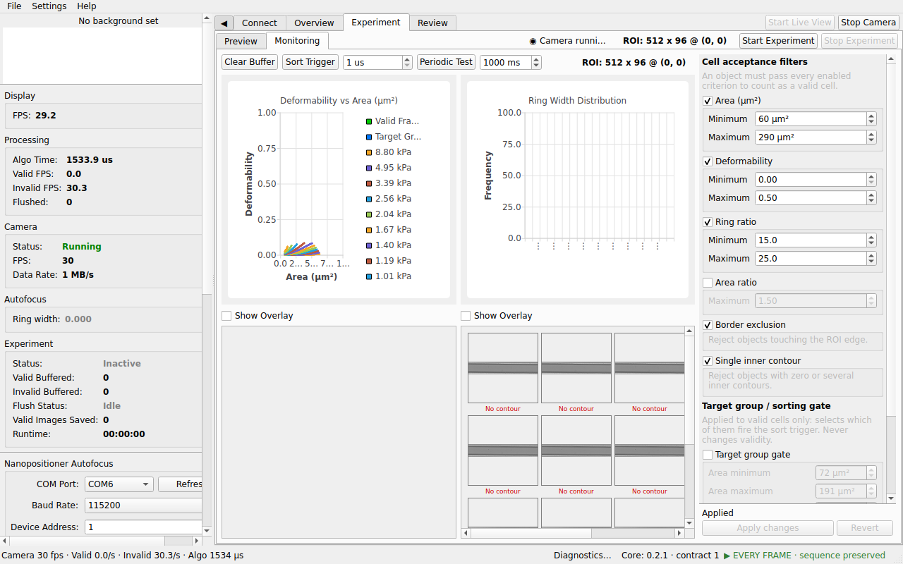
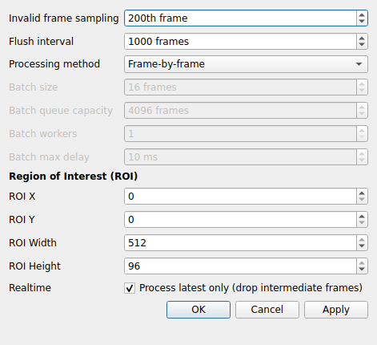
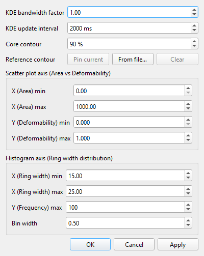

# Acquire & Record

The acquisition workflow: start the camera, frame the region of interest,
tune processing while watching the preview and monitoring charts, then
record an experiment to HDF5.

## Start the camera

Click **Start Live View** (main tab-bar corner). Frames start streaming from
the connected camera (or the mock folder) and the status-bar statistics
come alive. **Stop Camera** halts acquisition; statistics reset to zero.
Both buttons, and the Space bar over the preview, go through one guarded
command path: while an experiment is running or its data is being saved,
every way of stopping the camera is refused with the same message until the
experiment is stopped. A camera that fails to open or disconnects shows the
backend's reason in the status bar and offers **Start Live View** again.

## Overview tab — frame the ROI

- Shows the raw live stream (display rate capped independently of the
  camera rate, so a fast camera does not overload the UI).
- The semi-transparent **red rectangle** is the region of interest (ROI):
  drag it to reposition. The ROI feeds processing and recording directly,
  and the current geometry is echoed in the status bar
  (`ROI: w x h @ (x, y)`).
- Advanced: the tab hosts the camera-side GenICam script editor. **Apply to
  Camera** stops capture while the script is applied — restart the camera
  afterwards.

## Experiment ▸ Preview — tune processing

- The canvas shows the **processed** view. Overlay modes: **Off / Mask /
  Contours / Both**. While following live, cell colors mean
  **blue = target group, green = valid, red = invalid**.
- Playback controls under the canvas let you pause and scrub the recent
  frame buffer; **save buffer to disk** exports it as a single uncompressed
  AVI (ImageJ/Fiji-compatible) or a folder of TIFFs, never overwriting
  existing output.
- A **background** frame is captured automatically (or set manually from
  the playback panel); the current background shows in the sidebar preview.
- The **configuration inspector** below the image edits the processing
  configuration — thresholds, gates, multi-image, target group — and
  manages named profiles, including catalog-published ones. Its header
  shows the active **Profile**, its state (*Loaded*, *Edited (unsaved)*,
  *Saved*, *Conflict*), **Reset**, **Save**, and a **More…** menu with the
  profile-management actions (save as / rename / delete / duplicate,
  catalog updates and diff, choosing another config file, table view).
  Notices below the header explain unsaved edits, a file that changed
  elsewhere while you were editing (your edits are kept until you choose
  Reset or Save), a failed save, or an incompatible profile. The
  **Settings: Expanded / Compact / Hidden** bar at the bottom of the page
  sizes the inspector — *Compact* keeps only the profile/state header so
  the live image dominates during alignment — and the app remembers your
  choice and the divider position. Changes saved
  to the config file apply live; no restart needed. Note that several gates
  only take effect when their `enable_*` flag is on.

## Experiment ▸ Monitoring — watch the numbers

- Live histograms (area, deformability, brightness) and scatter plots
  (e.g. deformability vs. area) over the most recent frames, with
  scroll-to-zoom.
- Live totals: valid count, invalid count, algorithm FPS, valid FPS.
- Charts accumulate only while the tab is visible, and they are a live
  preview — they are not saved with the experiment.
- The top row also carries trigger bring-up controls (single and periodic
  test pulses) for commissioning a sorter.

### Tune panel

The panel on the right edits the acceptance criteria without leaving the
page. Each criterion is one box with its own enable checkbox in the title
and its values below it, named in full with units:

| Group | Criteria |
|---|---|
| **Cell acceptance filters** | Area (µm²) min/max · Deformability min/max · Ring ratio min/max · Area ratio max · Border exclusion · Single inner contour |
| **Target group / sorting gate** | Area (µm²) min/max · Deformability min/max — applied to valid cells only; selects which fire the sort trigger and never changes validity |
| **Multi-image acquisition** | Record image series · Images per trigger |

Unchecking a criterion greys out its values but keeps them visible, so you
can see what it would use when re-enabled.

Editing a value only changes the panel: the footer under the list reads
*N unapplied changes*, changed rows are marked with `*`, and nothing is
applied yet. **Apply changes** writes exactly those fields into the active
configuration file and applies them to processing; the footer returns to
*Applied* only once both have been confirmed. If the write fails the panel
stays dirty and says why. **Revert** discards the edits and reloads the
current configuration. The footer and its buttons never scroll out of
view. Impossible ranges (minimum above maximum) are flagged under the
state text and block Apply.

If the configuration changes elsewhere (a profile switch, an edit in the
Preview inspector or an external editor) while you have unapplied edits,
the footer shows *Conflict* and an alert appears; your edits are kept until
you click **Revert** to load the new values.

## Settings dialogs

**Settings ▸ Processing Settings** — the full processing configuration
form: blur/threshold, validity gates, ring-ratio and target-group gating,
multi-image capture.

**Settings ▸ Monitoring Settings** — chart bin counts, axis ranges, and
refresh rate for the Monitoring page.

**Settings ▸ Pixel-to-Micron** — the pixel→micrometre conversion factor
(default 0.4886 µm/px) used for area and derived metrics.

## Record an experiment

1. Make sure the camera is running (**Start Live View**). Start runs a
   readiness check first: if anything blocks it — camera not running, a
   requested hardware camera that fell back to the simulated one, the
   pinned processing core not active, no free space at the destination, an
   unacknowledged save fault from the previous run — a dialog lists each
   blocked check with what to do about it. Warnings (no background image,
   simulated camera, Latest Frame delivery) do not block.
2. Click **Start Experiment** (Experiment tab-bar corner). A Save dialog
   asks where to write the HDF5 file (`.h5` is appended if you omit it).
   The app freezes the run's configuration (camera, ROI, processing core,
   configuration revision, background, calibration factor) into the file
   before the first frame; if the configuration changes between the check
   and the start, the start is refused and you simply start again.
   The run state in the Experiment tab-bar corner reads **Running** (with
   the file name in its tooltip) and the flushed-frame counter starts.
3. Click **Stop Experiment** when done. The run state goes through
   **Stopping** and **Saving** while the final flush and the metadata (ROI,
   background, configuration) are written in the background, then
   **Complete** — wait for **Complete** before pulling a USB drive. If any
   part of the save fails the state stays **Failed – recovery required**
   and an alert explains what to do; the next Start is blocked until the
   fault is acknowledged in the readiness dialog.

The run state is always written as text (Idle, Camera running, Starting,
Running, Stopping, Saving, Complete, Failed); the color is only a hint.

Recorded files contain the valid/invalid frame images, masks, per-frame
metrics, and the experiment metadata needed to reanalyse later — see
[Review & post-process](review-and-postprocess.md).

## Status bar, alerts and diagnostics

The status bar shows one compact line of live metrics on the left
(**Camera** fps · **Valid**/**Invalid** rates per second · **Algo** time ·
**Run** time and buffered frames while recording), the **Diagnostics…**
button, and the processing-core and acquisition-mode badges on the right.
The full statistics (display FPS, flushed totals, camera data rate, ring
width, buffer state) stay in the hardware panel on the left of the window.

| Field | Meaning |
|---|---|
| **Display** | Frames per second actually rendered in the preview |
| **Algo** | Realtime processing time per frame (µs) |
| **Valid / Invalid** | Classification rates per second |
| **Flushed** | Total valid frames written to HDF5 in the active experiment |
| **Camera** | Transport statistics from the camera (frame rate, MB/s) |
| **Ring width** | Median ring ratio of validated frames (drives autofocus) |

Rates reset to zero when an experiment starts or capture stops; totals
persist until the next experiment starts. A value shown as **n/a** was not
reported by the camera; it is never displayed as 0.

**Alerts.** Warnings and errors that need your attention (a failed camera
start, a save failure, a configuration file changed on disk while you were
editing it) appear in a banner above the tabs with the reason and what to
do. Repeats of the same problem are counted on one line, **Details** lists
every open alert, and **Acknowledge** hides the banner — it does not clear
the underlying condition; that clears when the cause is fixed. Metrics
updates never remove an alert.

**Diagnostics…** (status bar or Help ▸ Diagnostics…) opens a non-modal
window with the detailed values that used to crowd the status bar: capture
session state, requested vs confirmed delivery mode, transport counters
(delivered, lost, discarded, underruns, queue depths), frame age and
publish latency, the timestamp source, the active processing core and its
artifact hash, and process memory. It refreshes on every statistics tick
while open.

Below those values the dialog lists the **memory owners**: the camera SDK
buffers (estimated from the buffer count, or *unknown* when the camera
backend cannot report them — never shown as zero), the frame ring, the
experiment buffer, the Monitoring rings, the processing queues and the
presentation snapshot, each with current / peak / budget MB and how many
items the bound evicted. An owner marked **OVER** has exceeded its declared
budget. The last line separates **display** counters (frames the preview
rendered or skipped because it draws at a capped rate) from real losses:
skipping a frame on screen never affects what was processed or recorded.
The experiment buffer's byte budget can be set per profile with the
`experiment_buffer_max_mb` key (default 512 MB).
