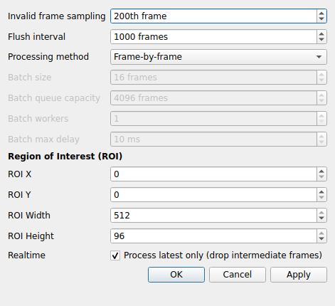
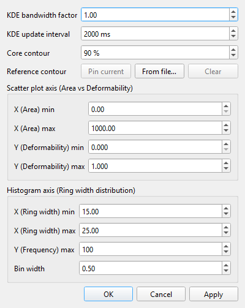
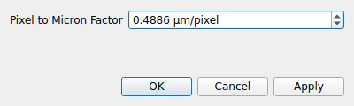

# Acquire & Record

The acquisition workflow: start the camera, frame the region of interest,
tune processing while watching the preview and monitoring charts, then
record an experiment to HDF5.

## Start the camera

Click **Start Live View** (main tab-bar corner). Frames start streaming from
the connected camera (or the mock folder) and the status-bar statistics
come alive. **Stop Camera** halts acquisition; statistics reset to zero.
Both buttons, and the Space bar over the preview, go through one guarded
command path: while an experiment is running or its data is being saved,
every way of stopping the camera is refused with the same message until the
experiment is stopped. A camera that fails to open or disconnects shows the
backend's reason in the status bar and offers **Start Live View** again.

## Overview tab — frame the ROI

- Shows the raw live stream (display rate capped independently of the
  camera rate, so a fast camera does not overload the UI).
- The semi-transparent **red rectangle** is the region of interest (ROI):
  drag it to reposition. The ROI feeds processing and recording directly,
  and the current geometry is echoed in the status bar
  (`ROI: w x h @ (x, y)`).
- Advanced: the tab hosts the camera-side GenICam script editor. **Apply to
  Camera** stops capture while the script is applied — restart the camera
  afterwards.

### Wafer Grid — locate the chip

**Wafer Grid** reads the wafer's dot-grid fiducials in the live image to
identify the chip design, the chip (die), and the absolute wafer position.
It is an alignment aid on **Overview**, separate from cell processing.

1. Start Live View and keep **Overview** visible.
2. Click **Wafer Grid: Off** beside the ROI controls. The button changes to
   **Wafer Grid: On**. Click it again to turn localization off.
3. Bring a region containing several rows and columns of fiducial dots into
   clear focus. Localization samples the latest frame periodically (by
   default every 250 ms), rather than decoding every camera frame.

When localization succeeds, orange circles mark detected dots and a cyan
cross marks the image centre. The text shows **Wafer X** and **Y** in µm
at that centre, rotation **θ** in degrees, measured **µm/px**, **direct**
or **mirrored** orientation, the design name and, when the centre falls
within a registered chip boundary, **chip** followed by its name. The last
line gives the dot count, **votes** and decoding time in **ms**. These are
mask coordinates; the bundled Wafer_soRT mask is enlarged by 1.5%.

The bundled design registry recognises **Wafer_soRT DC sorting chip
(30 um channels)**, revision **2025-03-16** (`wafer-sort-rt`), with a 30 µm
dot pitch. Recognition requires that design's encoded fiducial pattern;
an arbitrary dot grid or an unregistered chip design is not enough. A
locally installed design registry can add designs. There is no design
selector in the Overview toolbar; recognition uses the configured registry.

If it does not lock:

- **Wafer grid: waiting for a frame** — check that Live View is running
  and Overview is visible.
- **too few dots** or **no consistent code window** — move away from ports
  or a channel-only view to an area with more fiducials. Check focus,
  illumination and the pixel-to-micrometre calibration used for detection.
- **too many blobs**, **lattice fit failed** or **bit agreement too low** —
  improve the dot image and check that the wafer matches an installed design.
- **ambiguous code windows** or **ambiguous design (...)** — no position is
  accepted; try another fiducial area. If it persists, ask the instrument
  maintainer to check the design registry.
- **Dot-grid localization is not available: …** — the toggle was rejected;
  use the reason in the dialog when reporting the problem.

An unsuccessful decode shows the reason and dot count in red text, without
valid dot/centre markers. Localization pauses when Overview is hidden,
including when you switch to **Experiment**. It does not decode alongside
experiments, even if **Wafer Grid: On** remains selected; returning to
Overview resumes localization. Overview is unavailable while an experiment
is active; stop the experiment before returning to alignment.

## Illuminated Live View — MindVision camera and LED strobe

This workflow is for a connected MindVision camera with an XGC + R5D rig:
a pulse generator connected through RS485 supplies the camera's external
trigger, and the camera's **OUT1** strobe drives the LED. The camera,
generator and LED driver must be connected and powered, with the configured
generator channel wired to the camera trigger input. Software discovery
cannot check that wiring or determine which channel you connected.

### Start and stop

1. Select the MindVision camera on **Connect** if it was not selected
   automatically. The bundled profile enables illuminated Live View and
   automatically looks for one compatible generator at address 1, using
   9600 baud, 8 data bits, no parity, 1 stop bit, and channel 1.
2. On **Overview**, click **Start Live View**. Connecting the camera or
   arriving on Overview does not start illumination. Start applies the saved
   camera setup, arms the strobe, then enables the generator's trigger train.
   No separate generator **Connect**, **Set** or **Start**, or **Apply to
   Camera**, is needed for the illuminated profile.
3. Click **Stop Camera** to stop Live View. Stop gates off the trigger
   train and drives the camera's OUT1 low to turn the LED off before
   releasing capture. Failed starts also use illumination cleanup.

If Stop reports that generator or LED **OFF** was not confirmed, check the
connections and use the generator **Stop** in **Advanced — Hardware Setup**
as directed by the error. Do not treat that message as confirmation that
the LED is dark. During an experiment, stop the experiment before stopping
capture, as described above.

Overview uses the full sensor at a requested **400 Hz** trigger rate, with
display refresh capped at **50 fps**. Switching to **Experiment** uses the
selected ROI and saved experiment trigger rate. Switching between those
tabs while live stops, reconfigures and resumes capture; switching while
stopped leaves capture stopped. Requested trigger rate and measured camera
FPS are different values.

### Save a preset or adjust exposure

Open **Experiment ▸ Preview**, choose **Settings: Expanded** if needed,
and select **Camera trigger & strobe (MindVision)** in the configuration
inspector. **Exposure (µs)**, **Requested FPS** and **Save** are available
without opening the advanced controls.

For a custom connection, stop Live View, expand **Advanced — Hardware
Setup**, and select **Port**, **Baud**, data bits, parity, stop bits,
**Addr** and **Ch** in **Pulse generator (external trigger source, RS485)**.
Click **Use XGC + R5D preset for Live View**. This saves the selected
connection and channel; it does not start hardware.

That preset saves a 512×96 ROI, **2: External** trigger with **Rising edge**,
one frame per trigger, zero trigger delay and jitter, and a **1000 Hz**
trigger train at **2%** duty (a **20 µs camera-trigger pulse**). The strobe
is **1: Semi-auto (delay+width)**, **Width (µs)** 100, **Delay (µs)** 0,
**Active low**. The LED strobe width is separate from the generator's
camera-trigger pulse width.

The preset button saves **100 µs exposure**; the bundled default profile
uses **2 µs exposure**, with the same 100 µs strobe. Custom saved profiles
retain their own values. To adjust **Exposure (µs)** or **Requested FPS**,
stop Live View, edit the value, click **Save**, then **Start Live View**.
Unsaved edits are not applied at Start. Save stages the next start without
operating hardware. Changing Requested FPS preserves the requested camera
trigger pulse duration by adjusting duty; it does not change exposure or
strobe width/delay. The FPS control is disabled for manual profiles.

### Troubleshooting illuminated Live View

- **No generator found or more than one matches** — check generator power,
  the serial adapter and address. For a custom or ambiguous rig, select the
  correct port and connection settings in Hardware Setup and save the preset.
  Automatic discovery requires exactly one compatible generator.
- **Save refuses the timing** — exposure and strobe delay plus width must
  fit the trigger period: exposure may equal it, but strobe delay plus width
  must be shorter. Reduce Requested FPS or correct the timing
  values reported by Save, then save again.
- **Start fails or frames stop arriving** — read the status-bar reason and
  check camera access, trigger wiring, generator and strobe connections.
  Camera-setting/readback failures prevent startup; acquisition faults shut
  down illuminated capture.
- **Image too bright or too dark** — stop, adjust Exposure and Save, then
  restart. Check the LED driver and optical setup as well. A requested
  strobe width describes the command, not a measurement of LED current.
- **Camera FPS differs from Requested FPS** — the camera and ROI determine
  the achievable rate; the generator's 400–40000 Hz setting range does not
  guarantee that acquisition rate. Overview deliberately uses 400 Hz.

## Experiment ▸ Preview — tune processing

- The canvas shows the **processed** view. Overlay modes: **Off / Mask /
  Contours / Both**. While following live, cell colors mean
  **blue = target group, green = valid, red = invalid**.
- Playback controls under the canvas let you pause and scrub the recent
  frame buffer; **save buffer to disk** exports it as a single uncompressed
  AVI (ImageJ/Fiji-compatible) or a folder of TIFFs, never overwriting
  existing output.
- A **background** frame is captured automatically (or set manually from
  the playback panel); the current background shows in the sidebar preview.
- The **configuration inspector** below the image edits the processing
  configuration — thresholds, gates, multi-image, target group — and
  manages named profiles, including catalog-published ones. Its header
  shows the active **Profile**, its state (*Loaded*, *Edited (unsaved)*,
  *Saved*, *Conflict*), **Reset**, **Save**, and a **More…** menu with the
  profile-management actions (save as / rename / delete / duplicate,
  catalog updates and diff, choosing another config file, table view).
  Notices below the header explain unsaved edits, a file that changed
  elsewhere while you were editing (your edits are kept until you choose
  Reset or Save), a failed save, or an incompatible profile. The
  **Settings: Expanded / Compact / Hidden** bar at the bottom of the page
  sizes the inspector — *Compact* keeps only the profile/state header so
  the live image dominates during alignment — and the app remembers your
  choice and the divider position. Changes saved
  to the config file apply live; no restart needed. Note that several gates
  only take effect when their `enable_*` flag is on.

## Experiment ▸ Monitoring — watch the numbers

- Live histograms (area, deformability, brightness) and scatter plots
  (e.g. deformability vs. area) over the most recent frames, with
  scroll-to-zoom.
- **Density (KDE)** in the top row colours every point of the
  deformability-vs-area scatter by how crowded its neighbourhood is: light
  blue for isolated cells, dark blue for the core of the population, the
  same pseudocolour view as a cytometry dot plot. The estimate is recomputed
  every 2 s (adjustable) in the background, so the chart never stalls;
  cells that arrived since the last estimate show in the lightest shade
  until the next one. While the toggle is on, target-group cells are drawn
  as squares instead of circles so they remain identifiable. Hover the
  toggle to see how many points the last estimate covered and how long it
  took. The setting is remembered between sessions.
- **Core contour.** With Density on, a solid blue line encloses the densest
  90% of the cells (the share is adjustable under Settings ▸ Monitoring
  Settings ▸ *Core contour*). A bimodal population shows one loop per
  cluster. To compare against an earlier state, *Pin current* in the same
  dialog keeps that contour on the chart as a dashed orange line; *From
  file…* takes the contour stored in a previous experiment instead (and is
  remembered across restarts); *Clear* removes it. A drift of the solid
  line away from the dashed one is the population shift.
- When Density is on during an experiment, the contour on screen at Stop is
  saved into the experiment file as a *provisional* core contour. It covers
  the most recent cells shown on the chart, not the whole run; the Review
  tab draws it dashed on that experiment's scatter.
- Live totals: valid count, invalid count, algorithm FPS, valid FPS.
- Charts accumulate only while the tab is visible, and they are a live
  preview — they are not saved with the experiment.
- The top row also carries trigger bring-up controls (single and periodic
  test pulses) for commissioning a sorter.

### Tune panel

The panel on the right edits the acceptance criteria without leaving the
page. Each criterion is one box with its own enable checkbox in the title
and its values below it, named in full with units:

| Group | Criteria |
|---|---|
| **Cell acceptance filters** | Area (µm²) min/max · Deformability min/max · Ring ratio min/max · Area ratio max · Border exclusion · Single inner contour |
| **Target group / sorting gate** | Area (µm²) min/max · Deformability min/max — applied to valid cells only; selects which fire the sort trigger and never changes validity |
| **Multi-image acquisition** | Record image series · Images per trigger |

Unchecking a criterion greys out its values but keeps them visible, so you
can see what it would use when re-enabled.

Editing a value only changes the panel: the footer under the list reads
*N unapplied changes*, changed rows are marked with `*`, and nothing is
applied yet. **Apply changes** writes exactly those fields into the active
configuration file and applies them to processing; the footer returns to
*Applied* only once both have been confirmed. If the write fails the panel
stays dirty and says why. **Revert** discards the edits and reloads the
current configuration. The footer and its buttons never scroll out of
view. Impossible ranges (minimum above maximum) are flagged under the
state text and block Apply.

If the configuration changes elsewhere (a profile switch, an edit in the
Preview inspector or an external editor) while you have unapplied edits,
the footer shows *Conflict* and an alert appears; your edits are kept until
you click **Revert** to load the new values.

## Settings dialogs

**Settings ▸ Processing Settings** — the full processing configuration
form: blur/threshold, validity gates, ring-ratio and target-group gating,
multi-image capture.

**Settings ▸ Monitoring Settings** — the Monitoring page's fixed axis
ranges, histogram bin width, and the two density (KDE) controls: the
*bandwidth factor* (1 = automatic per-axis bandwidth; above 1 smooths the
colouring, below 1 shows finer structure) and the *update interval* between
density estimates.

**Settings ▸ Pixel-to-Micron** — the pixel→micrometre conversion factor
(default 0.4886 µm/px) used for area and derived metrics.

## Record an experiment

1. Make sure the camera is running (**Start Live View**). Start runs a
   readiness check first: if anything blocks it — camera not running, a
   requested hardware camera that fell back to the simulated one, the
   pinned processing core not active, no free space at the destination, an
   unacknowledged save fault from the previous run — a dialog lists each
   blocked check with what to do about it. Warnings (no background image,
   simulated camera, Latest Frame delivery) do not block.
2. Click **Start Experiment** (Experiment tab-bar corner). A Save dialog
   asks where to write the HDF5 file (`.h5` is appended if you omit it).
   The app freezes the run's configuration (camera, ROI, processing core,
   configuration revision, background, calibration factor) into the file
   before the first frame; if the configuration changes between the check
   and the start, the start is refused and you simply start again.
   The run state in the Experiment tab-bar corner reads **Running** (with
   the file name in its tooltip) and the flushed-frame counter starts.
3. Click **Stop Experiment** when done. The run state goes through
   **Stopping** and **Saving** while the final flush and the metadata (ROI,
   background, configuration) are written in the background, then
   **Complete** — wait for **Complete** before pulling a USB drive. If any
   part of the save fails the state stays **Failed – recovery required**
   and an alert explains what to do; the next Start is blocked until the
   fault is acknowledged in the readiness dialog.

The run state is always written as text (Idle, Camera running, Starting,
Running, Stopping, Saving, Complete, Failed); the color is only a hint.

Recorded files contain the valid/invalid frame images, masks, per-frame
metrics, and the experiment metadata needed to reanalyse later — see
[Review & post-process](review-and-postprocess.md).

## Status bar, alerts and diagnostics

The status bar shows one compact line of live metrics on the left
(**Camera** fps · **Valid**/**Invalid** rates per second · **Algo** time ·
**Run** time and buffered frames while recording), the **Diagnostics…**
button, and the processing-core and acquisition-mode badges on the right.
The full statistics (display FPS, flushed totals, camera data rate, ring
width, buffer state) stay in the hardware panel on the left of the window.

| Field | Meaning |
|---|---|
| **Display** | Frames per second actually rendered in the preview |
| **Algo** | Realtime processing time per frame (µs) |
| **Valid / Invalid** | Classification rates per second |
| **Flushed** | Total valid frames written to HDF5 in the active experiment |
| **Camera** | Transport statistics from the camera (frame rate, MB/s) |
| **Ring width** | Median ring ratio of validated frames (drives autofocus) |

Rates reset to zero when an experiment starts or capture stops; totals
persist until the next experiment starts. A value shown as **n/a** was not
reported by the camera; it is never displayed as 0.

**Alerts.** Warnings and errors that need your attention (a failed camera
start, a save failure, a configuration file changed on disk while you were
editing it) appear in a banner above the tabs with the reason and what to
do. Repeats of the same problem are counted on one line, **Details** lists
every open alert, and **Acknowledge** hides the banner — it does not clear
the underlying condition; that clears when the cause is fixed. Metrics
updates never remove an alert.

**Diagnostics…** (status bar or Help ▸ Diagnostics…) opens a non-modal
window with the detailed values that used to crowd the status bar: capture
session state, requested vs confirmed delivery mode, transport counters
(delivered, lost, discarded, underruns, queue depths), frame age and
publish latency, the timestamp source, the active processing core and its
artifact hash, and process memory. It refreshes on every statistics tick
while open.

Below those values the dialog lists the **memory owners**: the camera SDK
buffers (estimated from the buffer count, or *unknown* when the camera
backend cannot report them — never shown as zero), the frame ring, the
experiment buffer, the Monitoring rings, the processing queues and the
presentation snapshot, each with current / peak / budget MB and how many
items the bound evicted. An owner marked **OVER** has exceeded its declared
budget. The last line separates **display** counters (frames the preview
rendered or skipped because it draws at a capped rate) from real losses:
skipping a frame on screen never affects what was processed or recorded.
The experiment buffer's byte budget can be set per profile with the
`experiment_buffer_max_mb` key (default 512 MB).
