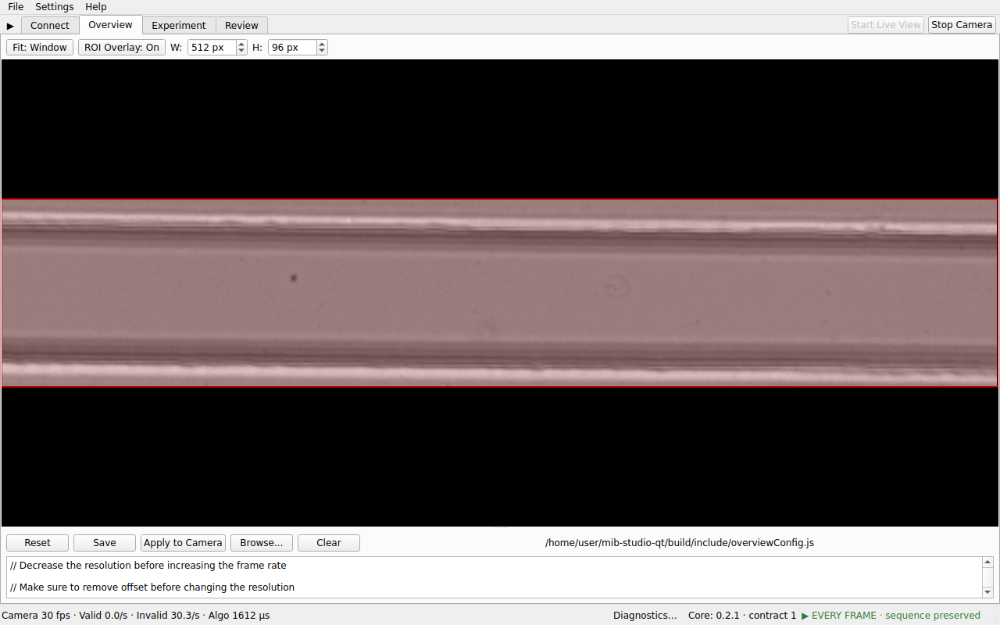

# Getting Started

## Install

Run the full installer `MIB_Studio_Qt_Setup_v<version>.exe` (from the
GitHub Releases page or your team's distribution channel). It installs the
application, the required runtimes, and — when crash reporting is
configured — the crash handler.

## Updates

The app checks for updates quietly on launch and only prompts when a new
version is available. Updates download as a small update package, are
checksum-verified, and install elevated.

- **Help ▸ Software Updates…** opens the update dialog: pick a channel
  (**stable** or **beta**) and any published version from the list —
  including older ones, so you can roll back (downgrades ask for
  confirmation).
- The default channel matches the build you are running (a beta build
  defaults to the beta channel); once you pick a channel explicitly, that
  choice sticks.
- If updates are disabled at boot (see Boot Service Toggles below), the
  Software Updates menu entry is greyed out.

## The main window

The window is a fixed set of task tabs plus a collapsible sidebar:

- **Connect** — pick the camera (first tab on startup). See
  [Connect a camera](connect.md).
- **Overview** — raw live view with ROI drawing.
- **Experiment** — nested **Preview** and **Monitoring** pages, with
  **Start/Stop Experiment** buttons in the tab-bar corner.
- **Review** — open and inspect recorded HDF5 files.
- **Start Live View / Stop Camera** buttons sit in the corner of the main tab
  bar and control frame acquisition regardless of the current tab.
- **Hardware panel** (left sidebar) — background image preview, capture
  statistics, nanopositioner controls, and syringe pump controls. Hide or
  show it with the **◀ / ▶** button in the left corner of the tab bar,
  *Settings ▸ Hide/Show hardware panel*, or `Ctrl+Shift+H`; hiding it never
  moves or resizes the window, and dragging the divider sets the width the
  panel reopens with (clamped so the workspace always keeps its minimum
  width on a smaller screen).

The window remembers its size and position between sessions and validates
them against the current desktop on startup: after moving to a smaller
monitor or a different scaling factor it shrinks or moves back on-screen
instead of leaving the title bar or controls unreachable. Long paths,
profile names and status values are shortened with an ellipsis (hover for
the full text; right-click to copy) rather than widening the window.
- **Status bar** — live capture/processing statistics (see
  [Acquire & record](acquire-and-record.md#status-bar-statistics)) and the
  current ROI.

## Menus

- **File** — *Open Data Folder* (`Documents\MIB_Studio_Qt`), *Open Logs
  Folder*, *Exit*.
- **Settings** — *Processing*, *Monitoring*, *Pixel-to-Micron*, *Syringe
  Pump* settings dialogs; *Boot Service Toggles…* (disable selected
  services on next launch, e.g. auto-update); *Profiles…* (jumps to the
  config/profiles editor on Experiment ▸ Preview).
- **Help** — *About*, *Software Updates…*, *Documentation* (opens the
  project page), *Report a Problem* (opens the issue tracker).

## Where your data lives

| What | Where |
|---|---|
| Experiment recordings (HDF5) | The path you choose in the Save dialog when starting an experiment |
| Default data folder | `Documents\MIB_Studio_Qt` (File ▸ Open Data Folder) |
| Application logs | `%LOCALAPPDATA%\MIB_Studio_Qt\logs` (File ▸ Open Logs Folder) |
| Crash reports | `%LOCALAPPDATA%\MIB_Studio_Qt\crashes` |
